```mermaid
flowchart TD
    Start([🚀 User Opens Dashboard]) --> Main[main Function]
    Main --> TabChoice{Choose Analysis Tab}
    
    subgraph Tab1["🔮 Tab 1: Future Forecast"]
        direction TB
        LoadMG1[load_material_groups]-->|"Display sorted groups"| SelectGroup1[👤 User Selects Group]
        SelectGroup1 --> LoadMC1[load_material_codes_by_group]
        LoadMC1 -->|"Display codes"| SelectCode1[👤 User Selects Code]
        SelectCode1 --> RunForecast[run_forecast]
        
        subgraph DataPrep1["📊 Data Preparation"]
            LoadData1[load_filtered_data]-->AggDaily1[aggregate_daily_for_target]
            AggDaily1-->DetectDensity1[detect_density_patterns]
            DetectDensity1-->DetectAnom1[detect_anomalies_iqr]
        end
        
        subgraph Model1["🤖 Model Training"]
            BuildModel1[build_prophet_model]-->Train1[model.fit]
            Train1-->Predict1[model.predict 12 months]
        end
        
        subgraph PostProc1["⚙️ Post-Processing Pipeline"]
            Scale1[scale_forecast_to_hist]-->DensityPat1[apply_density_pattern]
            DensityPat1-->Anomaly1[inject_anomalies]
            Anomaly1-->Cap1[enforce_historical_cap]
            Cap1-->March1[apply_march_adjustment]
        end
        
        RunForecast-->DataPrep1
        DataPrep1-->Model1
        Model1-->PostProc1
        PostProc1-->MonthlyChart1[create_monthly_chart_and_table]
        MonthlyChart1-->Display1([📈 Display Results + CSV])
    end
    
    subgraph Tab2["📊 Tab 2: Historical Validation"]
        direction TB
        LoadMG2[load_material_groups]-->SelectGroup2[👤 User Selects Group]
        SelectGroup2-->LoadMC2[load_material_codes_by_group]
        LoadMC2-->SelectCode2[👤 User Selects Code]
        SelectCode2-->RunForecastFY[run_forecast_fy_based]
        
        subgraph DataPrep2["📊 Data Split"]
            LoadData2[load_filtered_data]-->FilterTrain[Filter FY 2022-24]
            FilterTrain-->AggDaily2[aggregate_daily_for_target]
        end
        
        subgraph Model2["🤖 Model Training & Prediction"]
            DetectDensity2[detect_density_patterns]-->BuildModel2[build_prophet_model]
            BuildModel2-->Train2[Train on FY 22-24]
            Train2-->Predict2[Predict FY 24-25]
        end
        
        RunForecastFY-->DataPrep2
        DataPrep2-->Model2
        Model2-->PostProcess2[post_process_pipeline]
        PostProcess2-->Compare[create_comparison_chart_and_table]
        Compare-->Display2([📊 Display vs Actual])
    end
    
    TabChoice -->|"Tab 1"| Tab1
    TabChoice -->|"Tab 2"| Tab2
    
    style Start fill:#e1f5ff
    style Display1 fill:#c8e6c9
    style Display2 fill:#c8e6c9
    style TabChoice fill:#fff9c4
```

```mermaid
flowchart TD
    Start([▶️ Script Start]) --> Main[run_material_group_analysis]
    Main --> LoadCSV[load_data from CSV]
    LoadCSV --> Validate{Validate Schema}
    Validate -->|"✓ Valid"| LoopGroups{"For Each Group\n(M-C, M-G, M-R, M-S\nP-C, P-F, P-G, P-R\nP-S, R-T)"}
    Validate -->|"✗ Invalid"| Error([❌ Schema Error])
    
    subgraph GroupProcessing["🔄 Process Single Material Group"]
        direction TB
        FilterGroup[Filter by MATERIAL_GROUP_T]-->MakeDir[make_output_dir]
        MakeDir-->ProcessGroup[process_material_group]
        
        subgraph DataPrep["📊 Data Preparation"]
            AggDaily[aggregate_daily_for_target]-->DetectDensity[detect_density_patterns]
            DetectDensity-->DetectAnom[detect_anomalies_iqr]
        end
        
        subgraph Modeling["🤖 Prophet Modeling"]
            BuildModel[build_prophet_model]-->GenFuture[generate_future_and_predict]
        end
        
        subgraph PostProcessing["⚙️ Post-Processing"]
            direction TB
            ScaleHist[scale_forecast_to_hist]-->ApplyDensity[apply_density_pattern]
            ApplyDensity-->MonthEnd[apply_month_end_boost]
        end
        
        subgraph SpecialLogic["🎯 Group-Specific Logic"]
            direction LR
            MarchCheck{"March Spike\nGroup?"}
            MarchCheck-->|"M-R, M-S\nP-C, P-S, R-T"| MarchBoost[apply_march_spike_boost]
            MarchCheck-->|"Others"| PFCheck{"P-F Group?"}
            PFCheck-->|"Yes"| PFStab[apply_pf_stabilization]
            PFCheck-->|"No"| SkipSpecial[Continue]
            MarchBoost-->PFCheck
            PFStab-->SkipSpecial
        end
        
        ProcessGroup-->DataPrep
        DataPrep-->Modeling
        Modeling-->PostProcessing
        PostProcessing-->SpecialLogic
        SpecialLogic-->InjectAnom[inject_anomalies]
        InjectAnom-->EnforceCap[enforce_historical_cap]
    end
    
    subgraph Output["💾 Save Results"]
        direction LR
        SaveCSV["Save CSV"]-->PlotBoth[plot_daily_and_monthly]
        PlotBoth-->SavePlots["Save PNGs"]
    end
    
    LoopGroups-->|"Next Group"| FilterGroup
    EnforceCap-->Output
    Output-->Continue{More Groups?}
    Continue-->|"Yes"| LoopGroups
    Continue-->|"No"| Success([✅ All Groups Complete])
    
    style Start fill:#e1f5ff
    style Success fill:#c8e6c9
    style Error fill:#ffcdd2
    style Validate fill:#fff9c4
    style MarchCheck fill:#fff9c4
    style PFCheck fill:#fff9c4
```

```mermaid
flowchart TD
    Start([▶️ Validation Suite Start]) --> MainRun[run_validation_suite]
    MainRun --> LoadCSV[load_data from CSV]
    LoadCSV --> DefineTests["Define Test Cases\n(Material Groups, States,\nPlants, Customers)"]
    DefineTests --> TestLoop{"For Each\nTest Case"}
    
    subgraph TestCase["🧪 Single Test Case Execution"]
        direction TB
        RunTest[run_test_case]-->ApplyFilters[Apply filter combination]
        ApplyFilters-->MakeFolder[make_output_dir]
        MakeFolder-->CheckData{"Data Volume\nCheck"}
        
        CheckData-->|"< 10 points"| SkipTest[⚠️ Skip - Insufficient Data]
        CheckData-->|"≥ 10 points"| TargetLoop{"For Each\nTarget Column"}
        
        subgraph DataAnalysis["📊 Data Analysis"]
            AggDaily[aggregate_daily_for_target]-->DetectDensity[detect_density_patterns]
            DetectDensity-->DetectAnom[detect_anomalies_iqr]
            DetectAnom-->SummarizeAnom[summarize_anomalies_by_window]
        end
        
        subgraph Modeling["🤖 Prophet Model"]
            BuildModel[build_prophet_model]-->GenFuture[generate_future_and_predict]
        end
        
        subgraph PostProcess["⚙️ Post-Processing Pipeline"]
            direction LR
            Scale[scale_forecast_to_hist]-->Density[apply_density_pattern]
            Density-->InjectAnom[inject_anomalies]
            InjectAnom-->Cap[enforce_historical_cap]
        end
        
        subgraph Validation["📈 Accuracy & Output"]
            direction TB
            CalcAccuracy["calculate_accuracy_metrics\n(MAE, RMSE, MAPE, R²)"]-->SaveCSV[Save forecast CSV]
            SaveCSV-->SaveModel["Save Prophet model (PKL)"]
            SaveModel-->PlotDaily[plot_daily_and_monthly]
            PlotDaily-->SavePlots["Save annotated PNGs"]
        end
        
        TargetLoop-->DataAnalysis
        DataAnalysis-->Modeling
        Modeling-->PostProcess
        PostProcess-->Validation
        Validation-->NextTarget{"More\nTargets?"}
        NextTarget-->|"Yes"| TargetLoop
    end
    
    TestLoop-->|"Next Test"| RunTest
    NextTarget-->|"No"| TestComplete[Test Case Complete]
    SkipTest-->TestComplete
    TestComplete-->NextTest{"More\nTest Cases?"}
    NextTest-->|"Yes"| TestLoop
    NextTest-->|"No"| Summary["📊 Print Validation Summary\n(All Metrics Report)"]
    Summary-->Success([✅ Suite Complete])
    
    style Start fill:#e1f5ff
    style Success fill:#c8e6c9
    style SkipTest fill:#fff3e0
    style CheckData fill:#fff9c4
    style TestLoop fill:#f3e5f5
    style TargetLoop fill:#f3e5f5
    style NextTest fill:#f3e5f5
    style NextTarget fill:#f3e5f5
```

# Supreme Forecasting System - Technical Documentation

> **IMPORTANT**: All four Python files are **independent** and can be run separately. Each has its own purpose and execution flow.

## Table of Contents
- [Data Requirements](#data-requirements)
- [File 1: Material Code-wise Forecasting Dashboard](#file-1-material-code-wise-forecasting-dashboard)
- [File 2: Material Code-wise Forecasting with Categorical Drill-down Dashboard](#file-2-material-code-wise-forecasting-with-categorical-drill-down-dashboard)
- [File 3: Top 10 Material Group Demand Forecasting](#file-3-top-10-material-group-demand-forecasting)
- [File 4: Model Training, Predicting & Post-processing Pipeline](#file-4-model-training-predicting--post-processing-pipeline)

---

## Data Requirements

### Data Source Location
- **Snowflake Table**: `SUPREME_DB.SUPREME_SCH.DAILY_AGG_SALES_DATA`
- **Local CSV**: `training_data_v2.csv` (for model training scripts)

### Required Data Schema

All scripts require data with the following exact schema:

| Column | Dtype | Description |
|--------|-------|-------------|
| `BILLING_DATE` | datetime64[ns] | Transaction date |
| `MATERIAL_CODE` | object | Unique material identifier |
| `MATERIAL_GROUP_T` | object | Material group type code |
| `MATERIAL_GROUP_DESCR_1` | object | Material group description |
| `MATERIAL_GROUP_COMBINED` | object | Combined material group identifier |
| `CUSTOMER_STATE_NAME` | object | Customer's state name |
| `BILLING_UNIT_BASE` | object | Unit of measurement |
| `CUSTOMER_CODE` | object | Unique customer identifier |
| `BILLING_PLANT_CODE` | int64 | Plant/factory code |
| `TOTAL_BILLING_QTY_BASE_UNIT` | float64 | Total quantity billed (target variable) |
| `TOTAL_NET_WT` | float64 | Total net weight |
| `AVG_BILLING_QTY_BASE_UNIT` | float64 | Average quantity billed |
| `AVG_NET_WT` | float64 | Average net weight |

### Required Material Groups

The following unique material groups **must exist** in the dataset for error-free execution:

```
M-C, M-G, M-R, M-S, P-C, P-F, P-G, P-R, P-S, R-T
```

These groups are critical for:
- Material group-level forecasting (File 3)
- Categorical drill-down features (File 2)
- Pattern detection and post-processing logic

---

## File 1: Material Code-wise Forecasting Dashboard
**File**: `material_code_wise_forcasting_dashboard.py` (Original: `FINAL_POC_DASHBOARD.py`)

### Overview
Streamlit dashboard deployed on **Snowflake** for material code-level sales forecasting with two analysis modes.

### Technical Specifications
- **Framework**: Streamlit (Snowflake native)
- **ML Model**: Facebook Prophet
- **Data Source**: Snowflake table
- **Forecast Horizon**: 12 months (configurable)
- **Tabs**: 
  1. Future Forecast (from Apr 2025)
  2. Historical Comparison (validation on FY 2024-25)

### Key Features
- Material group → Material code hierarchical selection
- Fiscal year-based analysis (Apr-Mar)
- Prophet model with adaptive hyperparameters
- Advanced post-processing pipeline
- Monthly aggregation with downloadable CSV
- Interactive Plotly visualizations

### Function Flow Diagram



### Core Functions

| Function | Input | Processing | Output | Next Function |
|----------|-------|------------|--------|---------------|
| `load_material_groups()` | Snowflake session | SQL query for material groups sorted by volume | List[str] material groups | UI selector |
| `load_material_codes_by_group(material_group)` | material_group: str | SQL query filtered by group | List[str] material codes | UI selector |
| `load_filtered_data(material_code)` | material_code: str | SQL query by material code | DataFrame with all columns | `aggregate_daily_for_target` |
| `aggregate_daily_for_target(df, target_col)` | df: DataFrame, target_col: str | Group by date, sum/mean target | DataFrame(ds, y) | `detect_density_patterns` |
| `detect_density_patterns(hist_df)` | hist_df: DataFrame(ds, y) | Calculate day-of-week/month patterns | Dict with density metrics | `build_prophet_model` |
| `detect_anomalies_iqr(hist_df)` | hist_df: DataFrame | IQR-based anomaly detection | DataFrame + is_anomaly column | `inject_anomalies` |
| `build_prophet_model(df, sparse_mode)` | df: DataFrame(ds, y), sparse_mode: bool | Initialize Prophet with adaptive params | Prophet model object | model.fit() |
| `scale_forecast_to_hist(hist_df, forecast_df)` | hist_df, forecast_df: DataFrames | Match mean/std to historical | Scaled forecast_df | `apply_density_pattern` |
| `apply_density_pattern(hist_df, forecast_df)` | hist_df, forecast_df: DataFrames | Adjust forecast by day patterns | Adjusted forecast_df | `inject_anomalies` |
| `inject_anomalies(hist_df, forecast_df, cap_factor)` | hist_df, forecast_df, cap_factor: float | Add realistic spikes | forecast_df with anomalies | `enforce_historical_cap` |
| `enforce_historical_cap(hist_df, forecast_df, cap_factor)` | hist_df, forecast_df, cap_factor | Cap at 1.05x historical max | Capped forecast_df | `apply_march_adjustment` |
| `apply_march_adjustment(hist_daily, forecast_monthly_agg)` | hist_daily, forecast_monthly_agg: DataFrames | Boost March by 10% YoY | Adjusted forecast | `create_monthly_chart_and_table` |
| `post_process_pipeline(hist_df, raw_forecast)` | hist_df, raw_forecast: DataFrames | Run all post-processing steps | Final forecast_df | Visualization functions |
| `create_monthly_chart_and_table(hist_daily, forecast_daily, material_code)` | DataFrames + material_code: str | Aggregate to monthly, create Plotly chart | Plotly Figure + HTML table | Streamlit display |
| `run_forecast(material_code, forecast_months)` | material_code: str, forecast_months: int | Orchestrate entire forecast pipeline | Final forecast DataFrame | Display on UI |
| `run_forecast_fy_based(material_code)` | material_code: str | Train on FY22-24, predict FY24-25 | Predicted & actual DataFrames | `create_comparison_chart_and_table` |

---

## File 2: Material Code-wise Forecasting with Categorical Drill-down Dashboard
**File**: `material_code_wise_forcasting_with_categorical_drill_down_dashboard.py` (Original: `supreme4.py`)

### Overview
Advanced Streamlit dashboard with **multi-dimensional filtering** and **AI-powered insights**. Includes model validation capabilities.

### Technical Specifications
- **Framework**: Streamlit (Snowflake native)
- **ML Model**: Facebook Prophet
- **AI Integration**: Snowflake Cortex Complete (mistral-large2)
- **Data Source**: Snowflake table
- **Forecast Horizon**: 365 days
- **Tabs**: 
  1. Forecast Analysis
  2. Comparative Validation (2-year training validation)

### Key Features
- Multi-select filters: Material Groups, Material Codes, States, Plants, Customers
- Dimension-aware forecasting with post-processing
- AI-generated insights and model reasoning
- Validation mode comparing predicted vs actual FY 2024-25
- Weekly/monthly aggregation options
- Cached AI responses for performance

### Function Flow Diagram


### Core Functions

| Function | Input | Processing | Output | Next Function |
|----------|-------|------------|--------|---------------|
| `get_material_groups_ordered()` | Snowflake session | Query groups by data volume | List[str] sorted groups | UI multiselect |
| `get_material_codes_by_group(material_groups)` | Tuple[str] groups | Query codes for selected groups | List[str] material codes | UI multiselect |
| `get_states_ordered(material_codes)` | Tuple[str] codes | Query states filtered by codes | List[str] states | UI multiselect |
| `get_plants_ordered(material_codes)` | Tuple[str] codes | Query plants + mapping to names | List[str] plant names | UI multiselect |
| `get_customers_ordered(material_codes)` | Tuple[str] codes | Query customers sorted by volume | List[str] customer codes | UI multiselect |
| `load_filtered_data(material_codes)` | Tuple[str] codes | SQL query with filters | DataFrame (all columns) | `run_forecast_pipeline` |
| `run_forecast_pipeline(df, filters)` | df: DataFrame, filters: Dict | Aggregate, train, forecast, distribute | Dict of forecasts by dimension | Chart rendering |
| `aggregate_daily_for_target(df, target_col)` | df: DataFrame, target_col: str | Group by date, sum/mean | DataFrame(ds, y) | `build_prophet_model` |
| `detect_density_patterns(hist_df)` | hist_df: DataFrame | DOW/DOM pattern analysis | Dict with patterns | Post-processing |
| `build_prophet_model(df, sparse_mode)` | df: DataFrame, sparse_mode: bool | Adaptive Prophet initialization | Prophet model | model.fit() |
| `distribute_forecast_to_dimensions(df, forecast_total, dimensions)` | df, forecast_total: DataFrames, dimensions: List | Proportional distribution | Dict[dimension: DataFrame] | Aggregation |
| `prepare_weekly_data_summary(data_df, chart_context)` | data_df: DataFrame, chart_context: Dict | Weekly aggregation + statistics | str summary | `get_enhanced_ai_insights` |
| `get_enhanced_ai_insights(data_hash, chart_context, weekly_summary)` | Cached by data_hash, context, summary | Cortex Complete API call | str (tabular insights) | `parse_table_to_html` |
| `get_enhanced_model_reasoning(data_hash, chart_context, weekly_summary, patterns)` | Cached params + patterns: Dict | Cortex Complete API call | str (technical explanation) | `parse_table_to_html` |
| `parse_table_to_html(table_text, is_reasoning)` | table_text: str, is_reasoning: bool | Parse pipe-delimited table | HTML string | Streamlit display |
| `render_chart_with_controls(fig, data_df, chart_id, chart_title, tab_prefix, patterns, chart_context)` | Multiple params | Display chart + AI/Reasoning buttons | None (UI render) | Event handlers |
| `run_validation_forecast_pipeline(material_codes)` | Tuple[str] codes | Train on FY22-24, predict FY24-25 | Dict with predicted & actual DFs | Validation charts |
| `calculate_validation_metrics(predicted_df, actual_df)` | Both DataFrames (ds, y/yhat) | MAPE, RMSE, MAE, R² | Dict[metric: float] | Display in UI |
| `create_validation_comparison_chart(predicted_df, actual_df, title, aggregation, y_label)` | DataFrames + metadata | Create Plotly overlay chart | Plotly Figure | `render_validation_chart_with_reasoning` |
| `get_validation_reasoning(data_hash, chart_context, pred_summary, actual_summary, metrics)` | Cached params + summaries | Cortex Complete API for comparison | str (comparative analysis) | Display |
| `render_validation_chart_with_reasoning(fig, predicted_df, actual_df, chart_id, chart_title, aggregation, metric_name)` | Multiple params | Display chart + reasoning button | None (UI render) | User interaction |

---

## File 3: Top 10 Material Group Demand Forecasting
**File**: `top_10_material_group_demand_forecasting.py` (Original: `material_group_forecast.py`)

### Overview
Standalone Python script for forecasting **10 specific material groups** with specialized post-processing logic per group.

### Technical Specifications
- **Runtime**: Command-line script (not a dashboard)
- **ML Model**: Facebook Prophet with group-specific tuning
- **Data Source**: Local CSV (`training_data_v2.csv`)
- **Forecast Horizon**: 12 months
- **Output**: Folders per material group with plots & CSVs

### Target Material Groups
```python
["M-C", "M-G", "M-R", "M-S", "P-C", "P-F", "P-G", "P-R", "P-S", "R-T"]
```

### Special Processing Rules
- **March Spike Groups** (M-R, M-S, P-C, P-S, R-T): Apply YoY March growth boost
- **P-F Group**: Boom-bust stabilization (peaks at FY23-24, stabilizes FY24-25)
- **All Groups**: Month-end boost (1.5-3x multiplier)

### Function Flow Diagram



### Core Functions

| Function | Input | Processing | Output | Next Function |
|----------|-------|------------|--------|---------------|
| `load_data(path)` | path: str | Read CSV, parse dates | DataFrame | Validation |
| `make_output_dir(base_dir, material_group)` | base_dir, material_group: str | Create nested folder structure | str (output path) | File operations |
| `aggregate_daily_for_target(df, target_col)` | df: DataFrame, target_col: str | Daily sum of TOTAL_BILLING_QTY_BASE_UNIT | DataFrame(ds, y) | Pattern detection |
| `monthly_aggregate(df, method)` | df: DataFrame, method: str | Monthly sum/mean aggregation | DataFrame(month, value) | Plotting |
| `detect_density_patterns(hist_df)` | hist_df: DataFrame | DOW/DOM presence analysis | Dict with patterns | `apply_density_pattern` |
| `detect_anomalies_iqr(hist_df, multiplier)` | hist_df: DataFrame, multiplier: float | IQR anomaly detection | DataFrame + is_anomaly | `inject_anomalies` |
| `build_prophet_model(df, sparse_mode, holidays)` | df: DataFrame, flags | Prophet with CV-based tuning | Prophet model | `generate_future_and_predict` |
| `generate_future_and_predict(model, df, days)` | model: Prophet, df: DataFrame, days: int | Generate 365-day future, predict | DataFrame(ds, yhat, bounds) | `post_process_pipeline` |
| `scale_forecast_to_hist(hist_df, forecast_df)` | hist_df, forecast_df: DataFrames | CV-based confidence intervals | Scaled forecast_df | `apply_density_pattern` |
| `apply_density_pattern(hist_df, forecast_df)` | Both DataFrames | Reduce forecast on low-density days | Adjusted forecast_df | `apply_month_end_boost` |
| `apply_month_end_boost(hist_df, forecast_df)` | Both DataFrames | 1.5-3x boost on month-end days | Boosted forecast_df | Group-specific logic |
| `apply_march_spike_boost(hist_df, forecast_df, material_group)` | DataFrames + group: str | YoY March growth application | Forecast with March boost | `inject_anomalies` |
| `apply_pf_stabilization(hist_df, forecast_df, material_group)` | DataFrames + group: str | P-F boom-bust correction | Stabilized forecast | `inject_anomalies` |
| `inject_anomalies(hist_df, forecast_df, cap_factor)` | DataFrames, cap_factor: float | Add realistic spikes | forecast_df with anomalies | `enforce_historical_cap` |
| `enforce_historical_cap(hist_df, forecast_df, base_cap_factor)` | DataFrames, base_cap: float | Dynamic cap based on growth trend | Capped forecast_df | Save operations |
| `post_process_pipeline(hist_df, raw_forecast, material_group)` | DataFrames + group: str | Orchestrate all post-processing | Final forecast_df | Plotting |
| `plot_daily_and_monthly(historical_df, forecast_df, out_dir, material_group)` | DataFrames + metadata | Create matplotlib plots | None (saves PNGs) | File I/O |
| `process_material_group(df, material_group, out_base, forecast_months)` | df: DataFrame, group: str, params | Full pipeline for one group | Dict with results | Loop iteration |
| `run_material_group_analysis(data_path, out_base)` | data_path, out_base: str | Process all 10 groups | List[Dict] results | Script completion |

---

## File 4: Model Training, Predicting & Post-processing Pipeline
**File**: `model_training_predicting_post_processing_pipeline.py` (Original: `train2.py`)

### Overview
Comprehensive **testing framework** for validating Prophet forecasts across multiple filter combinations.

### Technical Specifications
- **Runtime**: Command-line script
- **ML Model**: Facebook Prophet
- **Data Source**: Local CSV (`training_data_v2.csv`)
- **Forecast Horizon**: 12 months
- **Purpose**: Model validation & accuracy testing
- **Output**: Forecast folders per test case with metrics

### Test Cases
Validates forecasts with combinations of:
- Material groups
- States (Delhi NCR, Maharashtra)
- Plants
- Customers
- Sparse/medium/dense data scenarios

### Function Flow Diagram



### Core Functions

| Function | Input | Processing | Output | Next Function |
|----------|-------|------------|--------|---------------|
| `load_data(path)` | path: str | Read CSV, parse dates, validate | DataFrame | Test setup |
| `make_output_dir(base_dir, filter_slug)` | base_dir, filter_slug: str | Create test case folder | str (output path) | File operations |
| `slugify_filters(filters)` | filters: Dict[str, List] | Convert filters to folder name | str slug | `make_output_dir` |
| `aggregate_daily_for_target(df, target_col)` | df: DataFrame, target_col: str | Daily aggregation for target | DataFrame(ds, y) | Pattern detection |
| `monthly_aggregate(df, target_col, method)` | df: DataFrame, target_col, method: str | Monthly sum/mean | DataFrame(month, value) | Plotting |
| `detect_density_patterns(hist_df)` | hist_df: DataFrame | DOW/DOM analysis with yearly counts | Dict with patterns | Model input |
| `detect_anomalies_iqr(hist_df, multiplier)` | hist_df: DataFrame, multiplier: float | IQR anomaly detection + magnitude | DataFrame + is_anomaly, ratio | `summarize_anomalies_by_window` |
| `summarize_anomalies_by_window(an_df, window)` | an_df: DataFrame, window: str | Count anomalies per year/month/quarter | Dict[window: int] | `inject_anomalies` |
| `build_prophet_model(df, sparse_mode, holidays)` | df: DataFrame, flags | Prophet with adaptive parameters | Prophet model | `generate_future_and_predict` |
| `generate_future_and_predict(model, df, days)` | model: Prophet, df: DataFrame, days: int | Fit model, generate future, predict | DataFrame(ds, yhat, bounds) | `post_process_pipeline` |
| `scale_forecast_to_hist(hist_df, forecast_df)` | hist_df, forecast_df: DataFrames | Match historical mean/std | Scaled forecast_df | `apply_density_pattern` |
| `apply_density_pattern(hist_df, forecast_df)` | Both DataFrames | Apply DOW/DOM density reduction | Adjusted forecast_df | `inject_anomalies` |
| `inject_anomalies(hist_df, forecast_df, cap_factor)` | DataFrames, cap_factor: float | Inject anomalies matching historical frequency | forecast_df with anomalies | `enforce_historical_cap` |
| `enforce_historical_cap(hist_df, forecast_df, cap_factor)` | DataFrames, cap_factor: float | Cap yhat at 0.90x historical_max | Capped forecast_df | Accuracy calculation |
| `post_process_pipeline(hist_df, raw_forecast)` | hist_df, raw_forecast: DataFrames | Run all 4 post-processing steps | Final forecast_df | Metrics & plotting |
| `calculate_accuracy_metrics(historical_df, forecast_df)` | Both DataFrames | MAE, RMSE, MAPE, R² | Dict[metric: float] | Annotation on plots |
| `plot_daily_and_monthly(historical_df, forecast_df, out_dir, target_name, filters, accuracy, plot_prefix, agg_method)` | Multiple params | Create daily + monthly matplotlib plots | Tuple(daily_path, monthly_path) | File save |
| `run_test_case(df, filters, out_base, forecast_months, save_models)` | df: DataFrame, filters: Dict, params | Process one test case for all targets | Dict with results | Loop iteration |
| `run_validation_suite(data_path, out_base, max_tests)` | data_path, out_base: str, max_tests: int | Run all predefined test cases | None (creates output files) | Script completion |

---

## Installation & Setup

### Requirements

Install dependencies using the provided `requirements.txt`:

```bash
pip install -r requirements.txt
```

### For Snowflake Dashboards (Files 1 & 2)

1. **Upload to Snowflake**:
   - Navigate to Snowflake → Streamlit
   - Create New Streamlit App
   - Upload Python file
   - Grant access to `SUPREME_DB.SUPREME_SCH.DAILY_AGG_SALES_DATA`

2. **Required Snowflake Privileges**:
   ```sql
   GRANT USAGE ON DATABASE SUPREME_DB TO ROLE <your_role>;
   GRANT USAGE ON SCHEMA SUPREME_SCH TO ROLE <your_role>;
   GRANT SELECT ON TABLE SUPREME_DB.SUPREME_SCH.DAILY_AGG_SALES_DATA TO ROLE <your_role>;
   GRANT USAGE ON WAREHOUSE <your_warehouse> TO ROLE <yourr_role>;
   ```

### For Local Scripts (Files 3 & 4)

1. **Prepare Data**:
   ```bash
   # Ensure training_data_v2.csv is in the same directory
   ls training_data_v2.csv
   ```

2. **Run Scripts**:
   ```bash
   # File 3: Material Group Forecasting
   python top_10_material_group_demand_forecasting.py
   
   # File 4: Validation Suite
   python model_training_predicting_post_processing_pipeline.py
   ```

3. **Output Locations**:
   - File 3: `./material_group_forecasts/<group_name>/`
   - File 4: `./forecasts/<filter_slug>/`

---

## Output Files

### File 1 & 2 (Dashboards)
- Interactive Streamlit UI
- Downloadable CSV files for forecasts
- Plotly charts (not saved locally)

### File 3 (Material Group Forecasting)
Per material group folder contains:
- `forecast_TOTAL_BILLING_QTY_BASE_UNIT.csv` - Daily forecast data
- `daily_forecast_TOTAL_BILLING_QTY_BASE_UNIT.png` - Daily plot
- `monthly_forecast_TOTAL_BILLING_QTY_BASE_UNIT.png` - Monthly plot

### File 4 (Validation Suite)
Per test case folder contains:
- `forecast_<target>_<agg_method>.csv` - Forecast data
- `model_<target>_<agg_method>.pkl` - Saved Prophet model (if enabled)
- `<target>_<agg_method>_daily.png` - Daily forecast plot
- `<target>_<agg_method>_monthly.png` - Monthly forecast plot

---

## Statistical Methods & Algorithms

### Prophet Model Configuration
- **Seasonality Mode**: Adaptive (multiplicative for high CV, additive for low CV)
- **Changepoint Prior Scale**: 0.3 (dense) to 0.8 (sparse)
- **Seasonality Prior Scale**: 5.0 (dense) to 15.0 (sparse)
- **Yearly/Weekly Seasonality**: Always enabled
- **Daily Seasonality**: Disabled (controlled via density patterns)

### Post-processing Pipeline
1. **Scaling**: Match forecast mean/std to historical using z-score normalization
2. **Density Adjustment**: Reduce forecast on low-presence days (DOW/DOM analysis)
3. **Anomaly Injection**: Add spikes matching historical anomaly frequency (IQR-based)
4. **Historical Capping**: Dynamic cap at 0.90x to 1.5x historical_max based on growth trend
5. **Special Adjustments**:
   - Month-end boost (1.5-3x)
   - March YoY growth (for specific groups)
   - P-F stabilization logic

### Accuracy Metrics
- **MAPE** (Mean Absolute Percentage Error): Average % error
- **RMSE** (Root Mean Squared Error): Penalizes large errors
- **MAE** (Mean Absolute Error): Average absolute error
- **R²** (Coefficient of Determination): Variance explained (0-1)

---

## Troubleshooting

### Common Issues

**Issue**: `KeyError: 'MATERIAL_GROUP_T'`
- **Cause**: Missing material group column in data
- **Fix**: Ensure CSV/Snowflake table has `MATERIAL_GROUP_T` column

**Issue**: No material groups in dropdown
- **Cause**: No data matching the 10 required groups
- **Fix**: Ensure data contains: M-C, M-G, M-R, M-S, P-C, P-F, P-G, P-R, P-S, R-T

**Issue**: Prophet errors or warnings
- **Cause**: Insufficient historical data (<100 days)
- **Fix**: Filter for material codes with at least 100 days of data

**Issue**: Cortex API errors (File 2 only)
- **Cause**: Missing Snowflake Cortex privileges
- **Fix**: Contact Snowflake admin to enable Cortex features

**Issue**: Plots not displaying
- **Cause**: Missing matplotlib/plotly dependencies
- **Fix**: Reinstall requirements: `pip install -r requirements.txt`

---

## Performance Considerations

- **File 1**: Loads data on material code selection (~2-5 seconds)
- **File 2**: Multi-filter loading can take 5-15 seconds for large datasets
- **File 3**: Processes all 10 groups in ~5-10 minutes
- **File 4**: Validation suite can take 30+ minutes for all test cases

**Optimization Tips**:
- Limit date ranges in Snowflake queries
- Use `max_tests` parameter in File 4 for faster testing
- Cache AI insights (File 2 automatically caches by data hash)
- Filter by high-volume material codes first

---

## License & Credits

**Developed for**: Supreme Sales Forecasting System  
**Framework**: Facebook Prophet, Streamlit, Snowflake Cortex  
**Version**: 2.0  
**Last Updated**: February 2026

